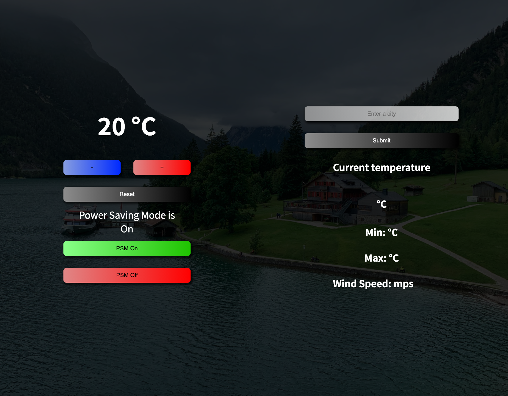
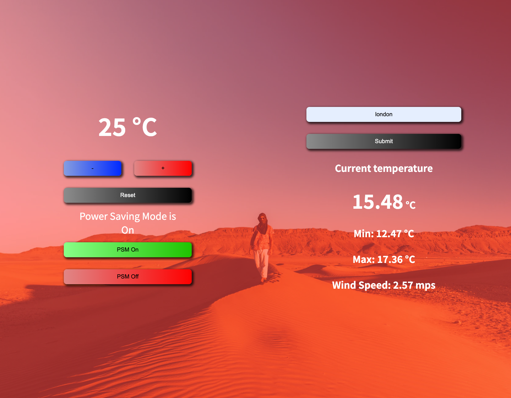
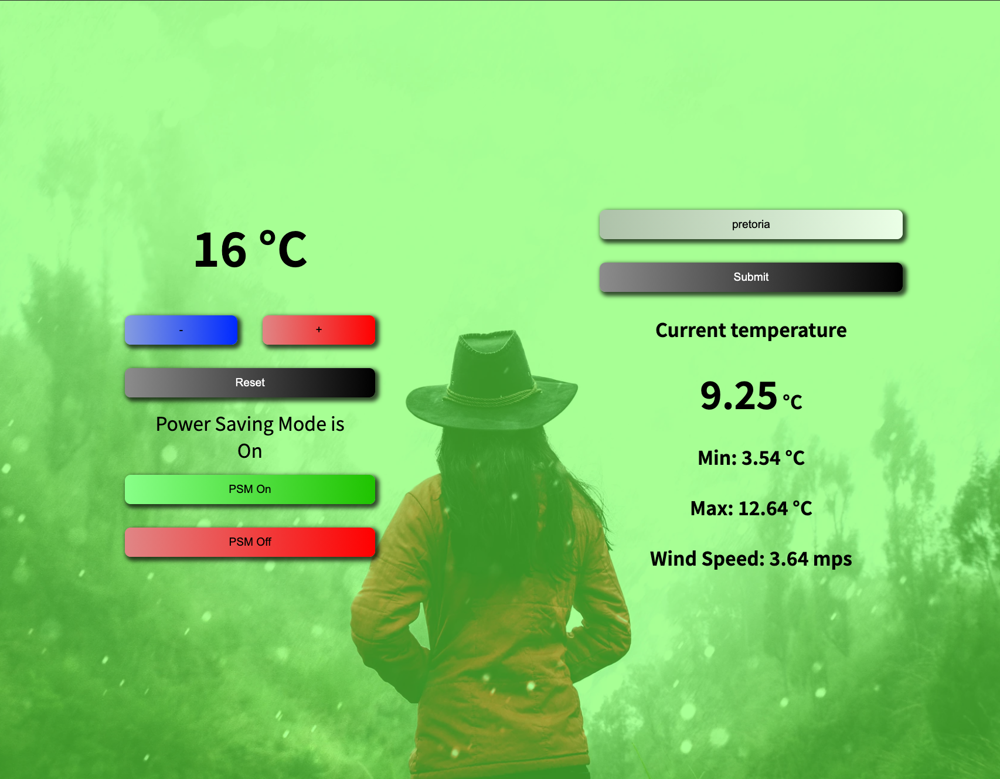

# Project Title
## Thermostat

### Motivation

Build a thermostat with JavaScript tht can be changed in the browser.

### User Stories

- [x] Thermostat starts at 20 degrees
- [x] You can increase the temp with an up function
- [x] You can decrease the temp with a down function
- [x] The minimum temperature is 10 degrees
- [x] If power saving mode is on, the maximum temperature is 25 degrees
- [x] If power saving mode is off, the maximum temperature is 32 degrees
- [x] Power saving mode is on by default
- [x] You can reset the temperature to 20 with a reset function
- [x] You can ask about the thermostat's current energy usage: < 18 is low-usage, <= 25 is medium-usage, anything else is high-usage.
- [x] (In the challenges where we add an interface, low-usage will be indicated with green, medium-usage indicated with black, high-usage indicated with red.)

## Build status

1. Initial commit.
2. Code and tests for thermostat to start at 20 degrees, increase the temperature, decrease the temperature and set a minimum limit of 10 degrees.
3. Code and tests for the thermostat to have a maximum temp of 25 when PSM is on and 32 when PSM if off. PSM is on by default. The thermostat can be reset.
4. Code and tests for thermostat to display the current usage.
5. User interface is complete.
6. Styling is complete. This is not yet responsive.

## Code style

Follow the principles of writing the tests first and then resolved the errors with a minimum amount of code.

## Tech/Framework used

* HTML5
* CSS3
* Javascript
* Jasmine (for testing)

## Installation

Run the HTML file in your browser

## Setting Up a Database

N/A

## Tests

####  13 specs, 0 failures

#### Thermostat
* when the power saving mode is on
* has a maximum temperature of 25 degrees
* when power saving mode is off
* has a maximum temp of 32
* increases temperature with up()
* starts at 20 degrees
* decreases the temperature with down()
* can switch power saving mode off
* can switch the power saving mode on again
* can reset to the default temp
* displaying usage levels
* when the temp is between 18 and 25
* it is considered as medium-usage
* when the temp is anything else
* it is considered as high-usage
* when the temperature is below 18 degress
* it is considered low-usage
* has a minimum of 10 degrees
* has a power saving mode on by default

## Screenshots

## How to use?

* Use the plus button to increase the thermostat.
* Use the minus button to decrese the thermostat.
* To increase the temperature over 25 degrees, switch PSM off.
* Reset the thermostat to 20 degrees by clicking the reset button.
* The usage is displayed in the background. Low = green, medium = black, high = red.

## Credits
* JP Ferreira
